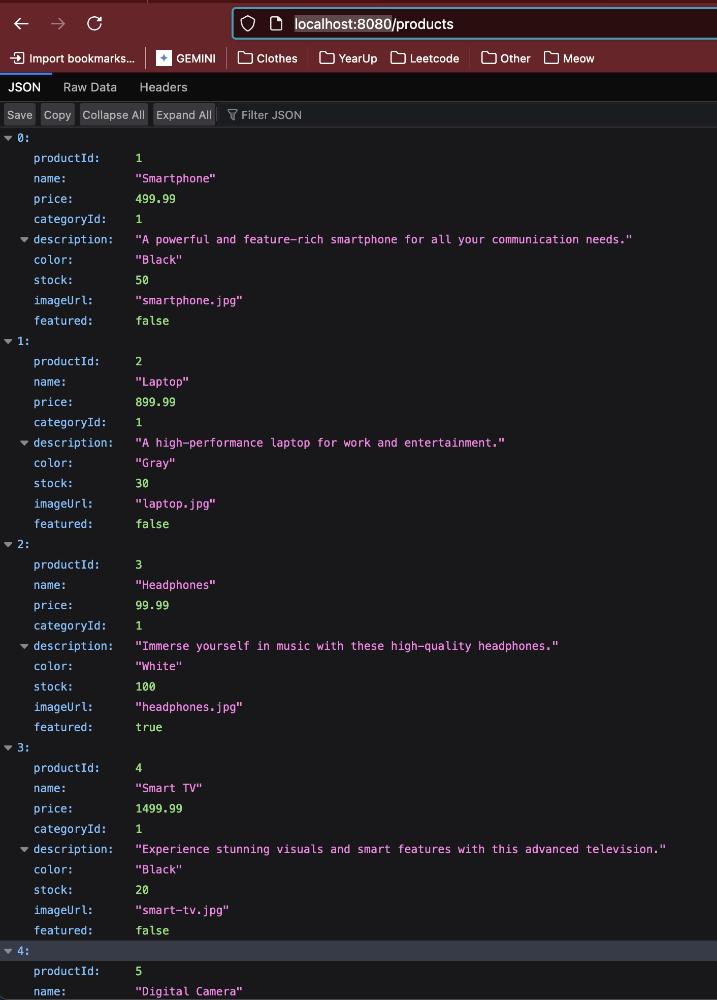

# Easy Shop
## Description
The Easy Shop was a project that I helped put to together by working on creating new features and working on bugs ont he existing project. The main focus of the project was to have a running shop website that allowed utilizes an API that I created to exercise all of the needed CRUD (Create, Read, Update, Delete) operations of the application. Through this, I was able to create successful API's for the mandatory Catagories and Products, as well as the optional Profiles, Shopping Cart, and Orders.

## The Diagram

This diagram shows the flow of the database that I am working with to create a proper application.

## Code Snippets
### CategoriesAPI

This is the API for categories! Most of my API's have a similar look to this. Just different methods for each of the CRUD operations!

### ShoppingCart Add Method

This is the most interesting out of what I coded. I had to do conditionals because of the Quantity of Shopping Cart Items.

## Results
### Mandatory Tests

Here I have all the easyshop Mandatory tests showing that they passed on Postman.

### Optional Tests

Here I have all the easyshop Optional tests showing that they passed on Postman.

### Products JSON

This is the results of the products api! We get a functional backend with each product shown as a JSON obect.

## Plusses and Deltas
This is a section where I talk about plusses and deltas with how I handled this project.

### Plusses
I honestly felt like I was zooming through the project pretty well. I ended up finishing early with the mandatory features and started working on extra features like the Orders, Profiles, and Shopping Cart.

I also found this portion really fun and zoomed through it as well.

With this project I was able to have 
1. A better understanding of how to debug Java/Spring Boot projects and APIs.
2. Experience working with Postman.
3. Small experience working as a full-stack developer!

### Deltas
1. I wish I had enough time to work on the front end portion a bit more. 
2. I would love to work with conditional render on whether or not a User is just a normal USER or an ADMIN.
3. I wish I was able to use a front end framework/library such as React or Angular to make the project for personalized to how I want it to work.
4. There is a bug that happens with the shopping cart (one of the optional phases) where it doesnt clear the cart sometimes. 

### Onward
I am going to continue working on this project to get any possible bugs removed as well as work on the front end!